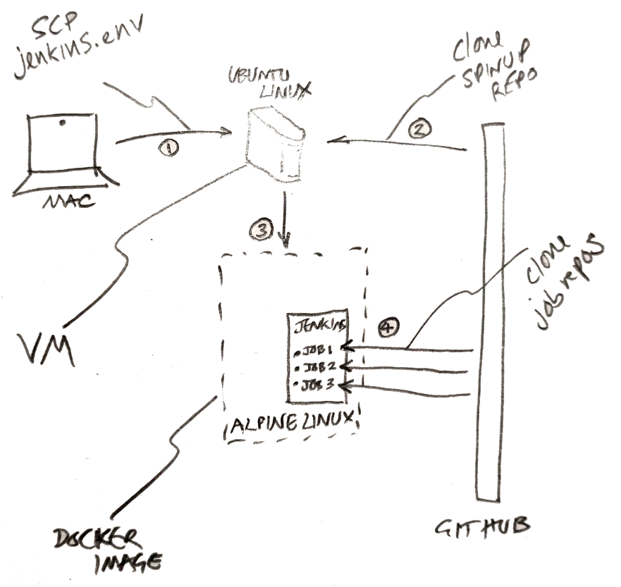

# Jenkins spin up

Use this repo to configure a stateless jenkins instance from scratch on a remote linux box for building and testing android apps.

These instructions (and the scripts in this repo) assume you are using a mac and have a github account for oauth access to jenkins. A basic familiarity with linux commands would be pretty helpful to understand what's going on, maybe briefly research and try out the following commands: `cd, ls, echo, touch, cat, rm, chmod`

First clone this repo. All the files we create need to be placed inside the top level direcory of the cloned repo (i.e. inside the jenkins-spinup folder)

To do this on the command line:

`git clone git@github.com:erdo/jenkins-spinup.git`
`cd jenkins-spinup`

## Step 1) Prepare the jenkins.env file

There are a few things we need to specify inside the **jenkins.env** file before running the script. For example the github user that we want to be the initial admin of the jenkins instance. We also need to specify the github oauth app details (if we don't have a github oauth app, we need to create one using the github web ui first, go to: Settings > Developer settings > OAuth Apps).

Create a file and name it **jenkins.env** then edit the contents of the file so it looks something like this:

`
GITHUB_ADMIN_USER=mygithubusername
GITHUB_OAUTHAPP_CLIENT_SECRET=05ag56f38myoauthappclientsecret73fa7765e0
GITHUB_OAUTHAPP_CLIENT_ID=103myoauthappclientid55be
`

To do this on the command line:

`echo "GITHUB_ADMIN_USER=mygithubusername
GITHUB_OAUTHAPP_CLIENT_SECRET=05ag56f38myoauthappclientsecret73fa7765e0
GITHUB_OAUTHAPP_CLIENT_ID=103myoauthappclientid55be" > jenkins.env`

You can check this worked by typing:
`ls`
`cat jenkins.env`

## Step 2) Procure a remote linux instance from a cloud provider

We next need to get hold of a linux box, we want something like Ubuntu Server 18.04, get it from Amazon EC2 or DigitalOcean or elsewhere.

Make sure to download the private ssh key of the remote linux box so that we can ssh into it later, we'll refer to that private key file as **linuxbox_ssh.key** (ssh doesn't care what you call this file, it's just a text file and it's the contents that matters, not the extension).

### Minimum specs

I have noticed that around 2G RAM seems to be the bare minimum spec that docker / jenkins will run with. Docker seems very space intensive and probably a 10G hard disk would be a minimum (potentially much more if you want to add more android SDKs to the docker image).

### Firewall

You'll most likely need to setup security rules so that the box is inbound accessible for Custom-TCP(8080) for administrating jenkins / github hooks, and for SSH(22) for accessing the box over ssh.

some help setting this up on Amazon:
https://d1.awsstatic.com/Projects/P5505030/aws-project_Jenkins-build-server.pdf

some help setting this up on DigitalOcean:
https://www.youtube.com/watch?v=-exFANqwlPM

## Step 3) Run the setup script

The setup script(s) do a number of things, including transfering the jenkins.env file to our remote linux box, applying security updates, setting up various ssh key pairs, installing and configuring Docker and Jenkins.

We can kick the whole process off by running **01_mac.sh** from this repository (it will call the rest of the scripts itself, **02_ubuntu.sh** and **03_docker.sh**), you may need to make the first script file executable manually first:

`chmod u+x 01_mac.sh`

- During the running of this script, you will occasionally be asked to copy and paste public key texts into the github web ui, just go to: **Settings > SSH and GPG keys > New SSH key** it doesn't matter what you call them

- Once the script knows the url of your jenkins instance, it will ask you to set the **Authorization callback URL** in the github oauth app which you specified in the jenkins.env file in Step 1. Go to: **Settings > Developer settings > OAuth Apps > {your app}** and update it there

- Apart from that, occasionally there will be a software update that needs to be applied that the script was not expecting, in that case you will be asked to confirm the installation (usually by typing `yes`) before the script will continue

You will get a minute or so to update the public SSH keys in github before the script moves on, so it's probably best to **log into github first** (if you miss the chance, don't worry, either scroll up or just run the script again - it will use the same public key files unless you manually go in and delete them). To run the script:

`./01_mac.sh ubuntu@ec2-blah-blah-blah.eu-west-3.compute.amazonaws.com`

# Background

## What does the script do?

## SSH key pairs

The script sets up secure communication between different parts of the system without using passwords (which would have to be backed up and/or stored somewhere):

- the linux box needs to be able to securely talk with github to clone the spinup repository
- jenkins jobs need to be able to securely talk with github to clone the repositories they will be building

For each case the script needs to create an ssh key pair (a private key file, and a public key file).

- We leave the private key on the remote linux box (it's good practice not to move private keys around, if you need it somewhere else, just delete it and create a new one where you need it)
- And we copy and paste the text from the corresponding public key file into github via github's web UI (it doesn't matter so much who has the public key, in this case it lets github confirm who it is talking to: the owner of private key)

The script handles everything for you except the copying and pasting bit, which it will prompt you to do. 

## Diagnosing problems

All sorts of things can go wrong, but the script tries to anticipate problems where it can, it will tell you if there are files missing or if you are not calling the script correctly.

However the main feature for ensuring the script runs to completion is that you can run it multiple times without causing any problems, it either skips over steps that it already completed, or re-performs steps where it causes no harm.

In particular, if an ssh key pair has already been created, it won't recreate it again - there is no need to replace the previous public ssh key you pasted in github, it won't have changed (unless you manualy ssh into the linux box and delete the generated key files yourself)

To diagnose an issue:

- the first step is probably to ssh in to the linux box manually
- you can paste lines of the script into the command line to see if they cause any problems when run
- you can also add echo commands in the script so that you can keep tabs on how far the script got before failing *(to do this you would need to create a branch and commit + push your changes to the scripts in that branch. The spinup process will pull any changes from github as it runs, but by default it will be on the master branch. Ssh in to the linux box, cd to the jenkins-spinup directory and checkout to your branch instead, now when you exit your ssh session and run the script from your mac, the script will continue running from the correct branch)*

Here's how to ssh manually into the linux box:

`ssh -v -i linuxbox_ssh.key ubuntu@blah-blah-blah.eu-west-3.compute.amazonaws.com`

## Changing this script

Unfortunately the scripts are not unit tested, so in theory it would be fairly easy to break them structurally. They expect various files and environment variables to be spelled in a specific way across different config files and scripts, so if you change the name of something in one script, make sure you check all the other files in the repo for other places you might also need to change.

The scripts are heavily commented to help people who aren't familiar with bash scripting to see what is going on.

Don't forget that the spinup process pulls itself from github on to the linux box, so if you make any changes on your mac, you need to commit and push those changes to github before the linux box will see any of the changes.

This causes another complication (mentioned briefly in the Diagnosing problems section) by default the second script clones the repo and continues from the master branch, if you are developing in a feature branch it's probably easiest to uncomment the line in **02_ubuntu.sh** below where it says "# switch to feature branch if developing script changes". This way you can test everything works before re-commenting that line and merging into the master branch.

Aside from the bash scripts, here are some important files you will likely want to change for your own purposes:

- **jenkins-pluggins.txt** - this is just a list of all the pluggins you want pre-installed on your jenkins instance, add whatever you want here

- **casc.yml** - this is the main config file for jenkins configuration as code, you will certainly want to change the seed job and add further seed jobs in the *job-dsl plugin* section, the seed jobs are designed to find further instructions inside a *Jenkinsfile* that should be present in the repository being cloned for the job

- **Dockerfile** - is where you will find the image definition that jenkins runs in, we start with a plain alpine linux image with jenkins installed on it and add various things to it, including the android command line tools and android build tools (which you will need to change periodically when newer versions become available) the more you add here of course, the larger the final image will be.

Generally I have chosen to always update the latest versions of everything where possible because this makes keeping up with security updates the default - but that of course increases the chance that one day the script will stop working and need to be fixed because an update broke something.

## Security considerations

- I'm not 100% sure that I am using linux users and groups correctly
- I'm not 100% sure that I am using docker correctly
- I'm not 100% sure that jobs running in jenkins have no way to access the linux box via environment variables or other
- The spinup script does not set up HTTPS access to jenkins
- The generated private ssh keys are left on the linux box (not unusual, although they are more usually kept in the .ssh folder)
- Unknown unknowns (I'm not a professional devops)
